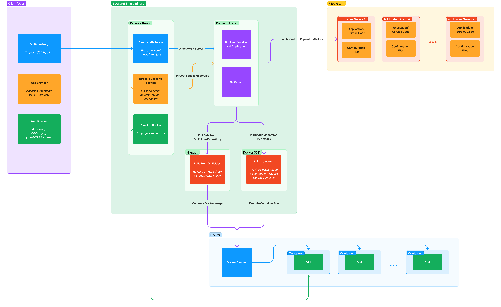
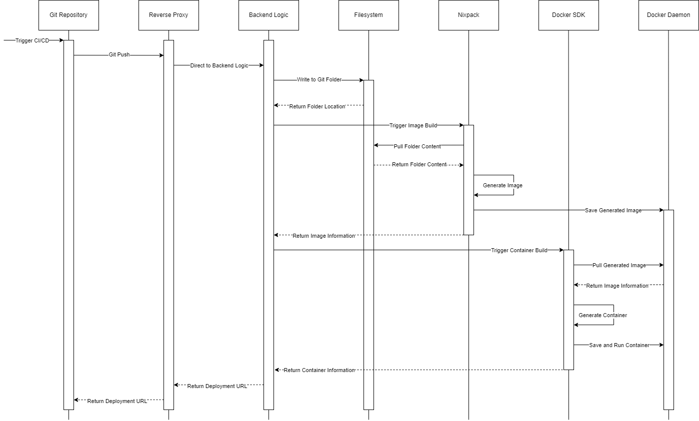

# PWS Features and Capabilities

Discover what are the capabilities of PWS and how it works.

## What Makes PWS Better?
Compared to previous installment, PWS improves several aspect that became the pain point for both teaching assistant and students.

1. **Easy to use**    
   Configure everything through an intuitive UI, reducing the amount of terminal and CLI-based display for building and deploying applications.
2. **Control at your hand**    
   No longer are you being held back by middleman. You can now create project, deploy, and configure yourself through PWS, without being dependent with anyone.
3. **Scalable performance**    
   Building application will no longer kill the server. PWS can scale according to hardware performance, enabling mass deployment especially near deadlines.

## How does PWS Work?

PWS is built on Rust, Docker, Tailwind, and black magic. All of the components run in a single binary, enabling blazingly fast performance and easy configuration on any servers.

All component works in synergy, from self-made git server to docker serving deployment controlled by nix, PWS can automatically receive your git push and builds it, providing its own domain, and serving you the web application, ready to be used.

You can view the full detail later after our paper has been published!