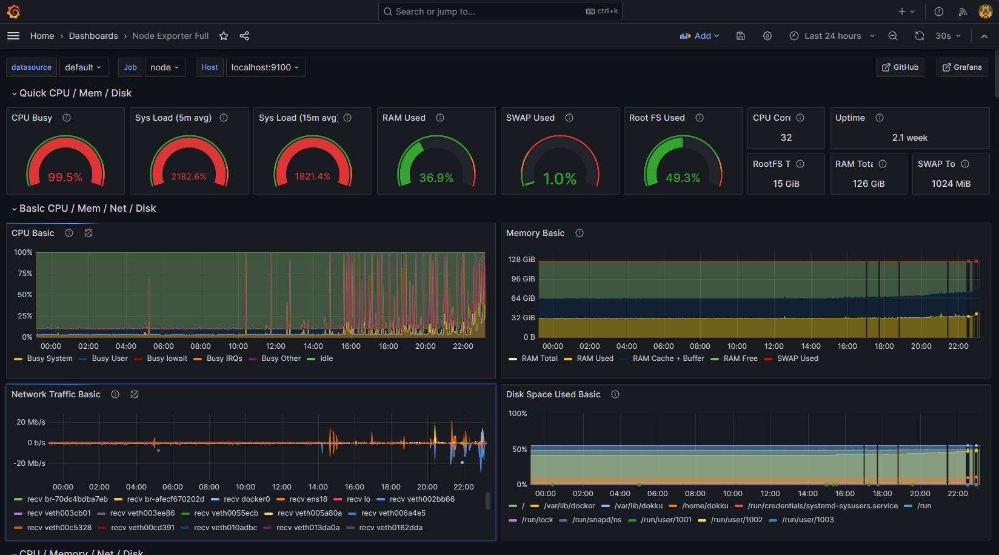

# Meet Pacil Web Service (PWS)

Welcome to Pacil Web Service, the newly developed service to deploy your web application.

## What is PWS?

PWS (Pacil Web Service) is a Platform as a Service (PaaS) aimed to help students, especially UI Computer Science (Fasilkom) students in deploying their web application in an easy to use manner.    

## Why make PWS?

When we first explore to find ideas back in September, we found that many courses in Fasilkom are struggling to find an alternative to deploy application required for the course's assignment. This happened due to the shutdown of Heroku's Free Tier, and a scarcity of free deployment application that is easily configurable and adapt to student's needs.    

There are many alternatives such as [Railway](https://railway.app/), [Adaptable](https://adaptable.io/), but as we've seen, they can't support the requirements of scale of certain courses, such as PBP.    

With this problem in mind, we decide to tackle this issue and create an house-built PaaS to support deployment for courses in Fasilkom, with the caveat of only support deployment within the given scope.

### What is the Scope?
To keep our sanity and ensure that this project can be completed in time, we have defined the scope of this project. 

#### The Main Goal
Our main goal is to support the deployment for mandatory courses that require a web deployment, in this case our service should be able to support PBP and RPL.

#### The Limitations
The limitation for what can be deployed are:
1. Must be a web application.
2. Only one framework in the application can be supported.
3. Only require one container (does not support microservices).

### But we already have DOKKU?
At the time of creating, DOKKU still has multiple issues:
1. **Scalability**    
   DOKKU has difficulty building and maintaining performance when it has to support large scale deployment, especially during individual assignment and nearing the deadline. This leads to long build time and performance issue.
   
2. **Ease of Use**    
   From our observation, configuring deployment for DOKKU takes quite the effort, from manually submitting form to create deployment keys, adding many configuration files, and more just to deploy. We aim to shorten this process and create something as close to Heroku as possible.
3. **Self-Service Capabilities**    
   We also observe that a lot of capabilities are limited from student side. Whenever students want to do something, such as deploying or deleting database, they have to request first to admins, which slows down progress. We wanted to remove this middleman, and provide students the capability needed to successfully deploy their application without being dependent on other factors.

Some items has been fixed eversince, but we aim to create an improvement and thus we keen on testing and developing PWS so it can be placed permanently in Fasilkom, supporting future deployments.

## How does PWS work?
You can view how PWS work and its capabilities by viewing the documentation at [PWS Features and Capabilities](/docs/background/pws-features).

## How do I use PWS?
You can start using PWS by checking out the [Getting Started Tutorial](/docs/getting-started/prerequisite) by reading the prerequisites first.