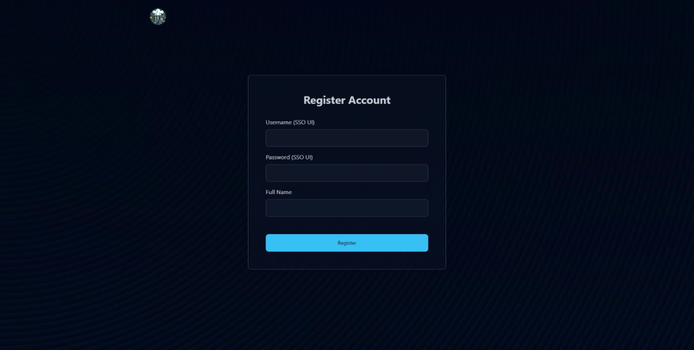

# Register and Login Account
PWS uses an account system to keep track of your applications. Note that we uses SSO for login, so you must use your UI account's credentials to access our service. This will be explained below.

## Registering Account
You will need to register your account first to use the service

1. Go to the [Registration Page](https://stndar.dev/register).
2. Enter the username, your full name, and your password in the following field.    
    
    :::warning You must use your UI Credentials
    You have to use your UI account for the username and password as we will have SSO check.    
    For example, if your UI account is `john.doe@ui.ac.id` and the password is `UI123`, then you must input `john.doe` as the username and `UI123` as the password.
    :::
    
    
3. You will be automatically logged in once registered.

## Logging In to Your Account
If you're logged out, you can login with the account you've created.

1. Go to the [Login Page](https://stndar.dev/login).
2. Enter the username and password that you use for registration.
   _Note that we use SSO login for our service, so you can input your UI username and password._     
   
    
3. You will be automatically redirected to the dashboard once logged in.

## Log Out from Your Account
You can log out anytime by entering [https://stndar.dev/logout](https://stndar.dev/logout) into your URL.