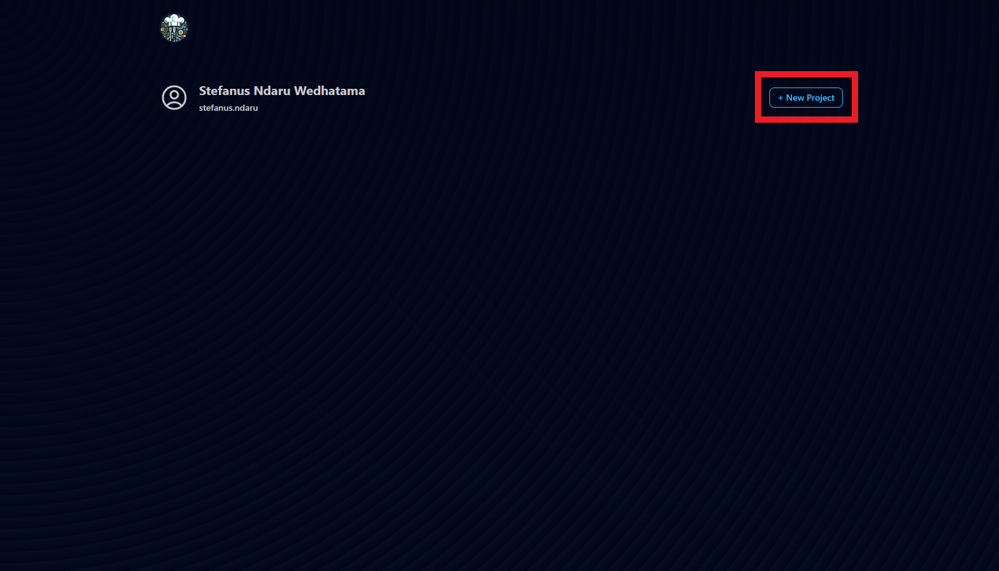
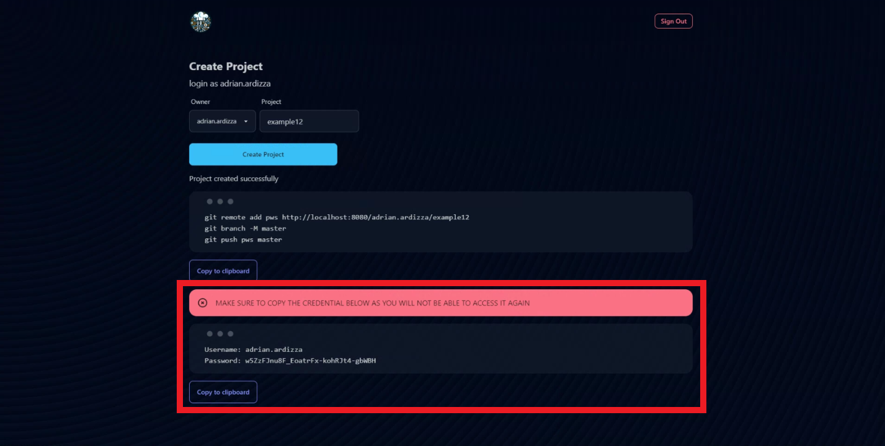

# Creating Your Project
Learn how to create your first project in PWS.

## Creating a Project
1. Go to the [Dashboard Page](https://stndar.dev/dashboard). Make sure you are logged in.
2. Click `New Project`.    
   
   
3. Select the owner and enter the project name.    
   
    :::warning Use Easy Project Name
    It is recommended that the project name is simple, containing only alphanumeric, lowercase, and has no symbol or empty space. For example, if your project is `24 Book Repository!`, the project name should be `24bookrepository`.
    :::
    
    
4. Copy the project token as it will not be shown later.
   
    :::danger DO NOT LOSE THE PROJECT TOKEN
    The credential below is required to push and deploy your service, make sure you've saved the token to continue to the next step, as you will be asked later.
    :::
    

5. Your project has been successfully created.