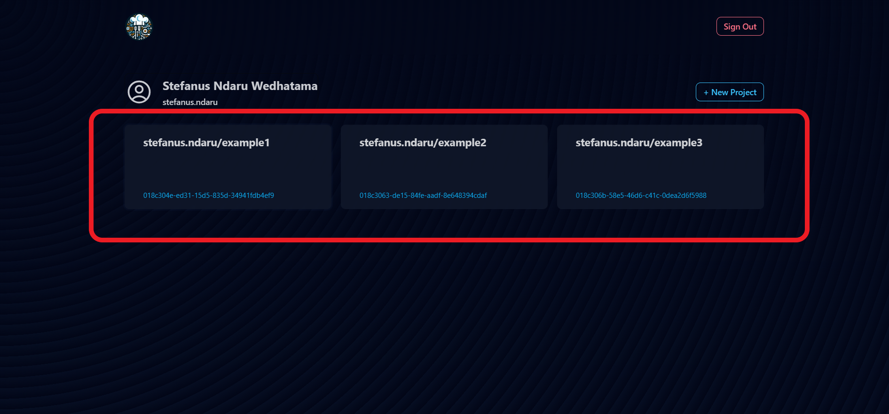

# Deploying Your Project
Learn how to deploy your first project in PWS.

:::warning Clone Your Project First

As this is an experimental service, we recommend you to clone your project to a separate folder so it won't disturb your current progress.

:::

## Pushing Changes

1. Go to the project page at `https://stndar.dev/{{ USERNAME }}/{{ PROJECT NAME }}`, or accessing the project you want to deploy from the dashboard.    
       
   
   
2. Copy the command to push. If you want to write it yourself, the format for the command is as follows: 
   ```
    git remote add pws https://stndar.dev/{{ USERNAME }}/{{ PROJECT NAME }}
    git branch -M master
    git push pws master
    ```
   

   :::tip Master Branch

   In the command, we set `git branch -M master`. This will replace the `main` branch with `master` as this is the default that we use on our PWS, hence `git push pws master`

   :::

3. Open a terminal on your computer and direct it to your project's directory. For example, `C:/johndoe/projects/bookworm`.
   
4. Ensure your project has the correct configuration. Make sure to read the [prerequisites page](/docs/getting-started/prerequisite) first.

5. In the terminal on your computer, paste the command above to push your project to PWS.

6. In the project page, you can see the status of the project being built and its latest build.    
       
   

7. Once the status is `Successful`, you can view the deployed application by clicking `Open` or accessing it through the URL format `https://{{ USERNAME }}-{{ PROJECT NAME }}.stndar.dev/`. Make sure to replace `.` with `-`. For example, if your username is `john.doe` and the project is `booker`, then the URL is `https://john-doe-booker.stndar.dev/`.
    
       
   

8. Congratulations, you have successfully deployed your first web application to PWS!

:::tip Update Changes

   If you want to do changes, after you have done `git remote add` and `git branch -M master` step, you can simply commit your changes and push your update directly.
   ```
   git add .
   git commit -m "{{ COMMIT MESSAGE }}"
   git push pws master
    ```
   :::