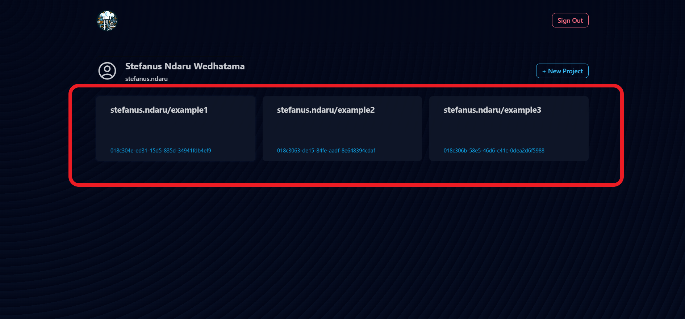
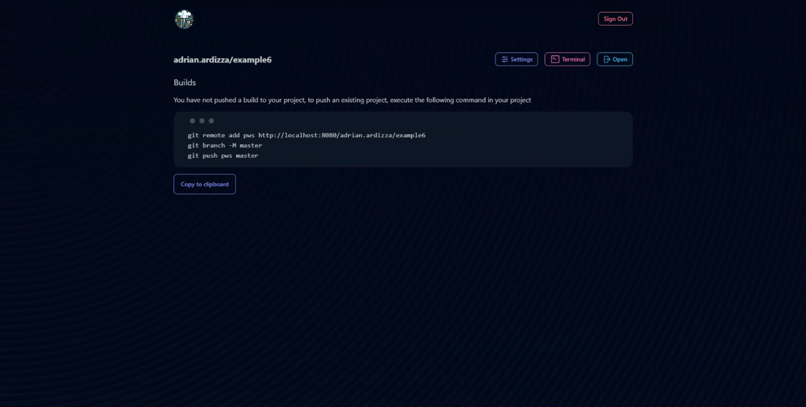
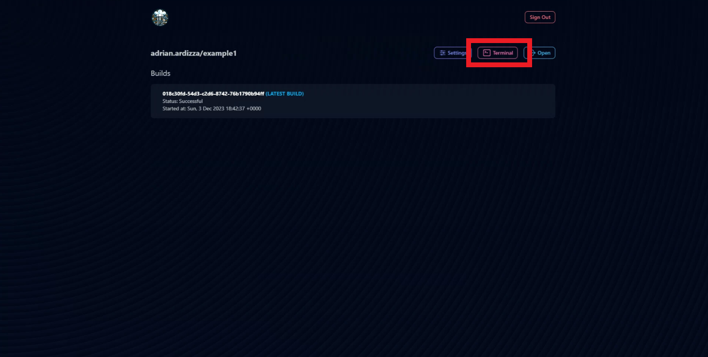
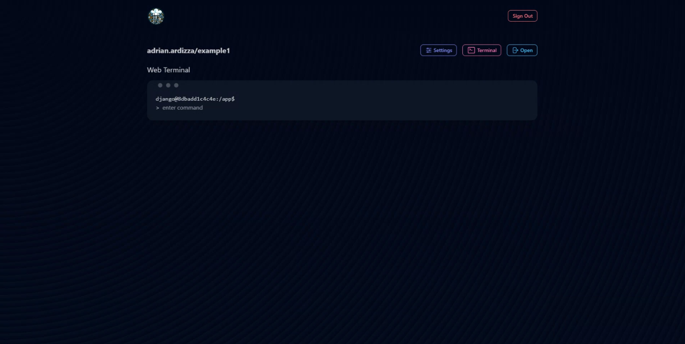

# Accessing Terminal
Learn how to access terminal and execute command to project in the server.

## Accessing Your Project Terminal
1. Go to the project page at `https://stndar.dev/{{ USERNAME }}/{{ PROJECT NAME }}`, or accessing the project you want to deploy from the dashboard.    
       
    
   
2. Click the terminal button.    
       
   

3. Now you can execute command to the Django Project such as `python manage.py createsuperuser`.
    
    